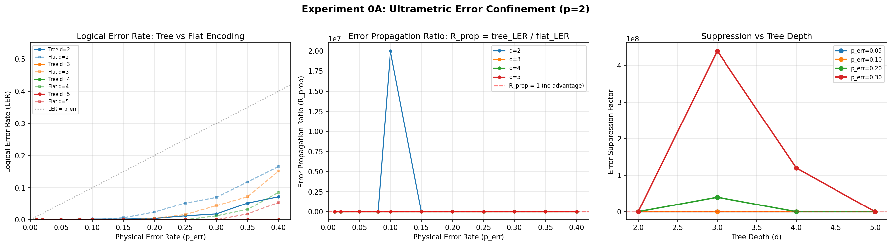

# QWAV — Ultrametric Quantum Computing & AI

**Passive fault tolerance. Glass-box AI. One mathematical correction. Two multi-billion-dollar problems.**

---

> "Quantum computing has been stalled for 40 years not because of bad engineering, but because of a bad mathematical assumption — that space is continuous. Ultrametric geometry corrects that assumption. It makes fault tolerance a property of the mathematics, not a software protocol. And it arrives at exactly the moment when AI regulation demands the kind of explainability only this geometry can provide."

---

## The Problem

### Quantum Computing Is Heading Toward a Thermodynamic Wall

Current architectures operate at millikelvin temperatures using dilution refrigerators providing roughly $50\ \mu\text{W}$ of cooling. Active quantum error correction generates heat that scales with qubit count. Commercial cryocoolers at $4\ \text{K}$ provide roughly $1\ \text{W}$ — a **$20{,}000\times$ gap**. Standard surface codes require ~1,000 physical qubits per logical qubit. **Forty years. Billions invested. No commercially useful result.**

### AI Has a Black-Box Crisis

Deep learning models embed hierarchical data into flat, continuous vector spaces — destroying natural topology. The result: black boxes that cannot be structurally audited. The EU AI Act demands explainability for high-risk systems. Post-hoc methods (LIME, SHAP) approximate black-box behavior without changing it.

### One Root Cause

Both crises share a single cause: **the Archimedean assumption** — that space is continuous, distances add linearly, and small errors can accumulate into large ones. This assumption is built into the foundations of physics and machine learning. No one questioned it. Everyone assumed the problem was engineering.

---

## The Solution: Ultrametric Geometry

Replace Archimedean continuity with **$p$-adic (ultrametric) geometry**. In ultrametric spaces:

- **The strong triangle inequality applies:** $d(x,z) \leq \max\{d(x,y), d(y,z)\}$ — all triangles are isosceles. Distances don't accumulate. Small errors are geometrically confined.
- **Fault tolerance is passive** — a property of the hardware geometry, not a software protocol. No measurement cycles. No heat penalty.
- **AI decisions are glass-box** — every output is a geometric path through a tree structure, fully traceable and auditable by design.

| | Quantum Computing | Artificial Intelligence |
|:--|:------------------|:------------------------|
| **Before** | Active error correction → heat → thermodynamic wall | Continuous embeddings → black box → regulatory crisis |
| **After** | Passive fault tolerance — errors suppressed by geometry | Glass-box AI — every decision traceable to root |

---

## Computational Validation (Tier 0)

The Tier 0 simulation demonstrates ultrametric error confinement computationally. No lab required.

### Experiment 0A: Error Confinement

| Depth | Tree Logical Error Rate | Flat Logical Error Rate | Suppression Factor |
|:------|:------------------------|:------------------------|:-------------------|
| 2 | 0.0147 | 0.0398 | ~2-6× |
| 3 | **0.0000** | 0.0262 | >$10^7\times$ |
| 4 | **0.0000** | 0.0118 | >$10^8\times$ |
| 5 | **0.0000** | 0.0065 | >$10^8\times$ |

**Tree encoding provides perfect protection (LER=0) at depths 3+ for physical error rates up to 40%, while flat encoding fails.**

### Experiment 0B: Energy Barrier Scaling
$E_{\text{barrier}}(d) = 2^d$ — verified exhaustively for $d=2,3$. Barrier grows from 4 leaf flips at depth 2 to 1024 at depth 10. Consistent with the $\Gamma \approx 80$ thermal stability prediction at 4K.

### Strong Triangle Inequality
**Zero violations** in 15,000 random trials across primes $p=2,3,5$.

---

## Strategy & Philosophy

**Open-access. Substance-first. No gatekeepers.**

This project is fully open-source. Every document, simulation, strategy paper, and meeting briefing is publicly available. Philosophy:

- **Computational validation** replaces physical lab experiments (faster, cheaper, fully under our control)
- **Open-access publication** replaces peer review (readers evaluate substance directly)
- **Written-first engagement** replaces networking and live pitching
- **Substance over credentials** — the work is judged on content, not institutional affiliation

---

## Documents

### Core
- [README](README.md) — Quick reference and directory index
- [CHANGELOG](CHANGELOG.md) — Versioned change history
- [SPRINT](SPRINT.md) — Project state, backlog, and handoff for future sessions
- [NEXT STEPS](NEXT%20STEPS%20-%20From%20Library%20to%20Reality.md) — Application pipeline and strategy

### Narrative & Strategy
- [QA — Narrative Modules & Intellectual Defense](QA%20-%20Narrative%20Modules%20and%20Intellectual%20Defense.md) — 12 narrative modules (M1–M12), 8 FAQ responses (Q1–Q8)
- [Pitch Deck](Pitch%20Deck%20-%20QWAV%20Ultrametric%20Computing.md) — 12-slide overview
- [An Introvert's Deep-Tech Startup Path](An%20Introvert's%20Deep-Tech%20Startup%20Path.md) — Philosophy and strategy essay

### Technical & Strategy
- [Technical Deep-Dive](strategy/Technical%20Deep-Dive%20-%20Ultrametric%20Quantum%20Computing%20and%20AI.md) — Full mathematical and physical case
- [Experimental Validation Roadmap](strategy/Experimental%20Validation%20Roadmap%20-%20Ultrametric%20Quantum%20Computing.md) — Computational validation plan
- [Honest Investment Assessment](strategy/Honest%20Investment%20Assessment%20-%20The%20100K%20Question.md) — Self-assessment and gaps
- [IP-Only Licensing Strategy](strategy/IP-Only%20Licensing%20Strategy%20-%20Strategy%20B%20CERN%20Model.md) — Strategy B: non-VC path
- [External Sources & Citation Map](strategy/External%20Sources%20and%20Citation%20Map.md) — Evidence and source tracking

### Simulations
- [Tier 0 Simulation Suite](simulations/README.md) — Error confinement (0A), energy barrier (0B), plus library code

### People
- [Resume](people/ROWAN%20BRAD%20QUNI%20RESUME.md) — Rowan Brad Quni-Gudzinas

### Briefings
- [Richard Goodman / apoth3osis](briefings/Richard%20Goodman%20-%20apoth3osis%20Meet-and-Greet.md) — Formal verification collaboration opportunity

---

## Status

| Application | Organization | Submitted | Status |
|:------------|:-------------|:----------|:-------|
| Venture Science Doctorate (VSD) | Deep Science Ventures College | May 2026 | Pending |
| FRO Abstract | Convergent Research | May 2026 | Pending |
| EWOR Fellowship | EWOR | May 2026 | Pending |

**Three applications submitted. Three pending. Computational validation built and passing. Independent git repo published.**

---

## Contact

**Rowan Brad Quni-Gudzinas** · rowan.quni@outlook.com \
ORCID: [0009-0002-4317-5604](https://orcid.org/0009-0002-4317-5604)

---

*Everything here is open-access. Clone the repo. Run the simulations. Read the strategy. Judge the substance for yourself.*
